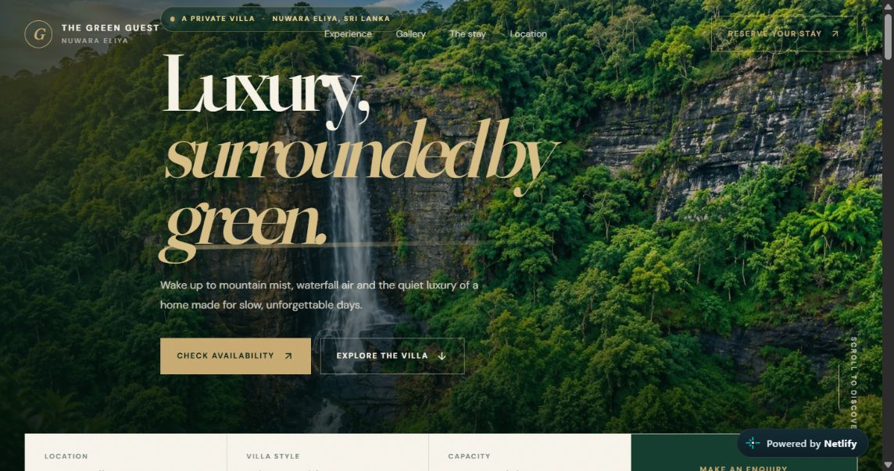

# The Green Guest — Nuwara Eliya

<p align="center">
  <a href="https://cozy-rugelach-3438d6.netlify.app/">
    
  </a>
</p>

A welcoming, responsive website for **The Green Guest**, a private villa in the cool highlands of Nuwara Eliya, Sri Lanka. It introduces the villa, showcases its rooms and surroundings, and helps guests enquire about dates directly through WhatsApp.

**Live website:** [cozy-rugelach-3438d6.netlify.app](https://cozy-rugelach-3438d6.netlify.app/)

## About the stay

The Green Guest is presented as a private residence for groups of up to 11 adults, with three bedrooms, modern bathrooms, a fully equipped kitchen, and a spacious living area. The website highlights the nearby Lover’s Leap Waterfall, Nuwara Eliya town, and the surrounding tea country.

## Website features

- Responsive, single-page layout for desktop and mobile screens
- Sections for the villa experience, gallery, stay details, location, and enquiries
- Filterable photo gallery for indoor and outdoor spaces, with a full-screen image viewer
- Stay information, including capacity, bedrooms, and amenities
- Location section with an embedded map for Lover’s Leap Waterfall
- Booking enquiry form for guest details, preferred dates, group size, contact preference, and a note
- Date validation to ensure check-out is after check-in
- WhatsApp enquiry link with the submitted booking details pre-filled
- Direct phone and WhatsApp contact links
- Lightweight owner dashboard for viewing enquiries saved in the current browser

## Technology

- React and TypeScript
- Vite
- Tailwind CSS and custom responsive styles
- pnpm workspaces
- Netlify for deployment

## Run locally

### Requirements

- Node.js 20 or newer
- pnpm 9 or newer

### Install and start the website

Run these commands from the repository root:

```bash
pnpm install
pnpm --filter @workspace/green-guest run dev
```

Vite will print the local development URL in the terminal.

### Build

Build just the guest website:

```bash
pnpm --filter @workspace/green-guest run build
```

The generated site is written to `artifacts/green-guest/dist/public`.

To type-check and build the full workspace, run:

```bash
pnpm run build
```

## Deploy with Netlify

The repository includes a `netlify.toml` configured with:

- **Build command:** `pnpm --filter @workspace/green-guest run build`
- **Publish directory:** `artifacts/green-guest/dist/public`
- **Redirects:** routes are served through the website entry point

Connect the GitHub repository to Netlify and use the build settings from `netlify.toml`. No environment variables are needed for the current website build.

## Project structure

```text
artifacts/
  green-guest/       Main guesthouse website
  api-server/        API workspace
  mockup-sandbox/    UI mockup workspace
lib/
  api-client-react/  Shared API client
  api-spec/          OpenAPI specification and code generation
  api-zod/           Zod API schemas
  db/                Database package and schema
scripts/             Workspace scripts
netlify.toml         Netlify build and publish settings
pnpm-workspace.yaml  Workspace package configuration
```

The main website source is in `artifacts/green-guest/src`. Images used by the site are in `artifacts/green-guest/public` and `artifacts/green-guest/dist/public` is generated during builds.

## Enquiries and owner dashboard

When a guest submits the enquiry form, the website saves a copy in that browser’s local storage and opens WhatsApp with the enquiry details ready to send. The website does not currently submit enquiries to a server or shared database.

The owner dashboard reads enquiries saved in the **same browser on the same device**. It has no sign-in or access control, and its records are not shared between devices. It is a lightweight convenience for this version of the site, not a secure booking-management system.

## Contact

- **Location:** Nuwara Eliya, Central Province, Sri Lanka
- **Phone / WhatsApp:** [+94 77 559 2762](https://wa.me/94775592762)

---

© The Green Guest · Nuwara Eliya, Sri Lanka
